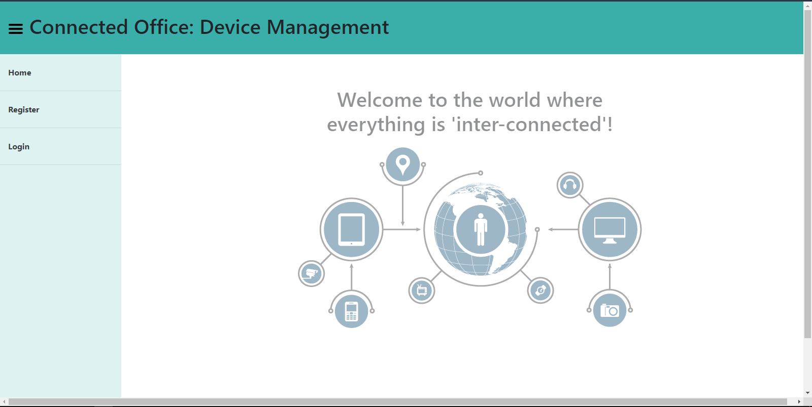
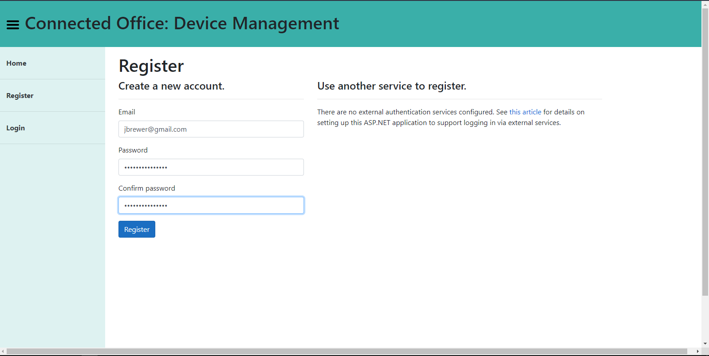
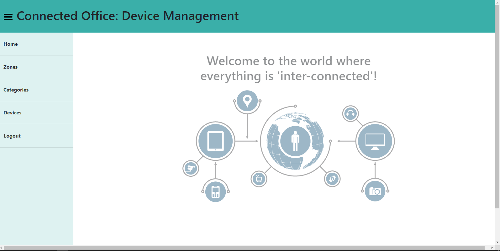
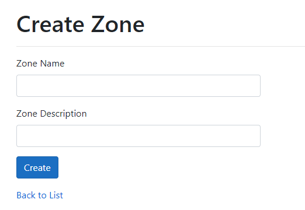
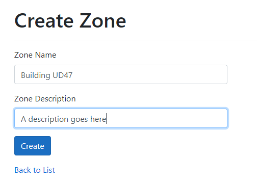
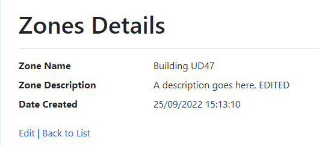
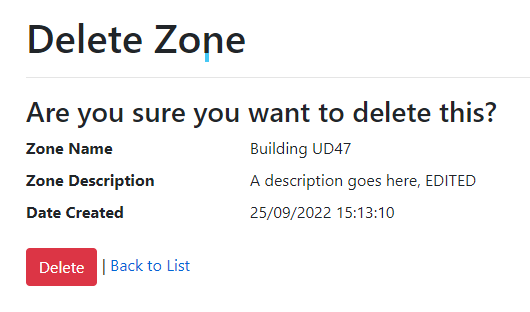

# CMPG-323-Project-3-35553367

Project 3 of cmpg 323 - Design Patterns (MVC)

This project is a web app that allows users to manage the IOT devices within their Organization, this app was built using

- ASP .NET 3.1
- Azure (For Hosting and Database)
- Entity Framework
- Microsoft Identity Framework

# How to use this project

1. Navigate to the [Hosted Website](TODO) you should see the following page
   
2. Click the Register button to add a new user;
   Enter your details and click register
   
3. You should now see 3 additional Buttons (Zone, Device, Categories) \
   **Zone** : Gives an overview of all the locations where IOT devices are stored \
   \
   **Device**: Gives an overview of all the devices in the company and where they are located \
   \
   **Categories**: Devices are divided into general categories based on the functionality of the device, this page allows you to manage categories and add new ones if need be \
   \
   Each of these pages have a similar UI and the functionality remains the same
   
4. Considering that let's navigate to Zone to get an overview of the UI, click on the Zone Button
   
5. The "+" Icon can be used to create a new Record  
      On clicking this button you will be taken to a create page.  
     
    
   
6. The "Pen" Icon can be used to edit a record  
     
   After clicking this icon you should be taken to the edit page  
     
   Click save to save your changes
7. The "Eye" Icon can be used to view additional details about a record  
     
   
8. The "Trash can" Icon can be used to delete a record  
     
     
   Delete will permanently delete the record this change **CANNOT** recovered

# References

- Bergman, P.-E. 2019. Repository Design Pattern. Medium. https://medium.com/@pererikbergman/repository-design-pattern-e28c0f3e4a30 Date of access: 25 Sep. 2022.
- Junior. 2016. https://stackoverflow.com/q/35190704 Date of access: 25 Sep. 2022.
- Mukesh Murugan. 2020. Repository Pattern in ASP.NET Core - Ultimate Guide. Code With Mukesh. https://codewithmukesh.com/blog/repository-pattern-in-aspnet-core/ Date of access: 25 Sep. 2022.
- Thomas. 2016. https://stackoverflow.com/a/35190726 Date of access: 25 Sep. 2022.
- Tom Dykstra. 2022. Implementing the Repository and Unit of Work Patterns in an ASP.NET MVC Application (9 of 10) | Microsoft Learn. MSDN. https://learn.microsoft.com/en-us/aspnet/mvc/overview/older-versions/getting-started-with-ef-5-using-mvc-4/implementing-the-repository-and-unit-of-work-patterns-in-an-asp-net-mvc-application Date of access: 25 Sep. 2022.
